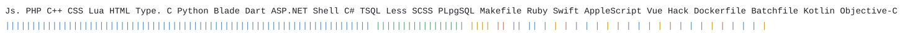

  

- 📫 İletişim **abdulmelik.derinkok@bilecik.edu.tr**

- 👨‍💻 **[https://derinkok.com.tr](https://derinkok.com.tr)**

**Google Drive Bağlantısı**
[Google Drive](https://drive.google.com/drive/folders/0B-oFuSw1PkbjcnVaZEhoOWVRZ28?resourcekey=0-bj_WTRbBRyzdVOW2ECzUxw&usp=share_link)

Drive Klasörleri
| Klasör  | Ders                                  |
|---------|---------------------------------------|
|  arabirim | Kullanıcı Arabirimi Tasarımı    |
|  is      | İşletim Sistemleri                      |
|  iys   | İçerik Yönetim Sistemleri |
|  staj   | Staj Yönergesi |
|  vtys   | Veritabanı ve Yönetim Sistemleri |

<!-- LANG-STATS:START -->

<!-- LANG-STATS:END -->

<h3 align="left">Languages and Tools:</h3>

                           

